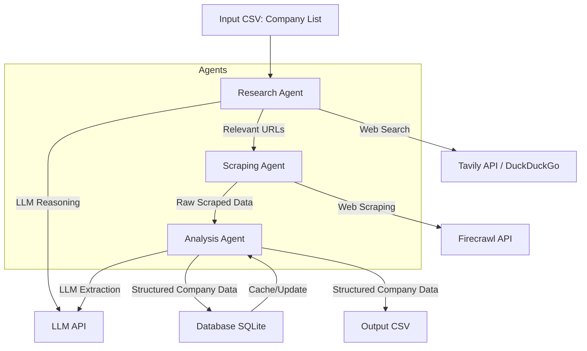

# Retail Warehouse Research Agent Architecture

## System Overview

This system is designed to automate the enrichment of retail and warehouse business prospect data using a multi-agent, LLM-powered pipeline. It orchestrates research, web scraping, data analysis, and structured storage, leveraging modern AI and web APIs.

## Architecture Diagram

## Component Descriptions

- **Input CSV**: List of companies to enrich (name, vertical, etc.)
- **Research Agent**: Uses Tavily (or DuckDuckGo fallback) to find the most relevant URLs for each company, focusing on official and high-quality sources. Uses LLM for reasoning and filtering.
- **Scraping Agent**: Uses Firecrawl API to extract raw content and structured data from the URLs provided by the research agent.
- **Analysis Agent**: Uses LLM to extract, validate, and structure key business metrics (fleet size, warehouse employees, facilities, stores, etc.) from the scraped data.
- **Database (SQLite/SQLAlchemy)**: Stores structured company data, supports caching and incremental updates.
- **Output CSV**: Exports enriched company data for downstream use.
- **Tavily API / DuckDuckGo**: Web search providers for finding relevant company information.
- **Firecrawl API**: Web scraping provider for extracting content from URLs.
- **LLM API (OpenAI/Anthropic)**: Provides advanced reasoning and extraction for research and analysis agents.

## Data Flow
1. **Batch or single company** is read from the input CSV.
2. **Research Agent** queries Tavily for relevant URLs about the company, using LLM for filtering.
3. **Scraping Agent** fetches and parses content from those URLs using Firecrawl.
4. **Analysis Agent** processes the scraped data, extracting structured business metrics using LLM.
5. **Results** are saved to the database and exported to an output CSV.
6. **Database** is used for caching, so companies are not re-processed if data is fresh.

## Extensibility
- Add new agents for additional enrichment tasks.
- Swap out APIs (e.g., use a different search or scraping provider) with minimal code changes.
- Add more business verticals or metrics in the Pydantic models.

---